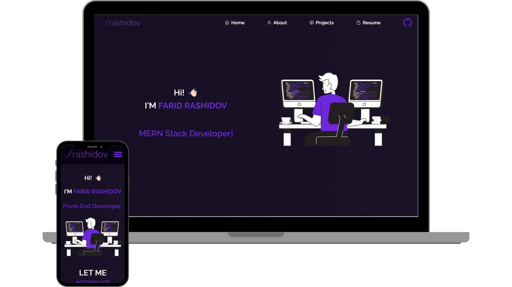

<h2 align="center">
  Farid Rashidov (Portfolio) 
  <a href="https://faridrashidov.com" target="_blank">Go to website</a>
</h2>

  

<h3 align="center">
    🔹
    <a href="https://github.com/imrashidov/Million.az-Website-Clone-Project/issues">Report Bug</a> &nbsp; &nbsp;
</h3>

## Built With

- React.js
- React Router
- Tailwind CSS
- React-icons
- React-pdf
- Typewriter
- ldrs

## Features

**🎨 Styled with Tailwind CSS**

**📱 Fully Responsive**

**📑 Multi-page website**

## 🛠 Installation and Setup Instructions

1. Installation: `npm install`

2. In the project directory, you can run: `npm start`

Runs the app in the development mode.\
Open [http://localhost:3000](http://localhost:3000) to view it in the browser.
The page will reload if you make edits.

### Show your support

Give a ⭐ if you like this website!

